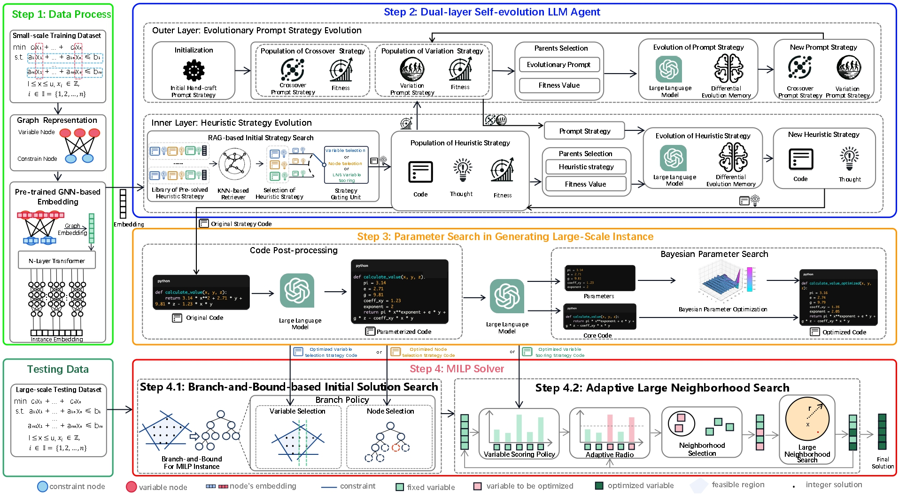

# L2SO



Official code implementation of "LLM-driven Streamlining Optimizer for Large-scale Mixed Integer Linear Programming Problems".

## Overview

This repository implements an LLM-driven framework for automated algorithm design to accelerate solvers for large-scale optimization problems. It features a novel dual-layer evolutionary agent that guides a Large Language Model to generate problem-specific operators, holistically co-optimizing the entire solution pipeline. By leveraging Retrieval-Augmented Generation (RAG) for a knowledge-infused and efficient search, this method consistently discovers higher-quality solutions than state-of-the-art solvers on ultra-large-scale benchmarks and demonstrates strong generalization to a broader class of combinatorial optimization problems.

## Supported Problems

### MILP Problems
- **IS**: Independent Set Problem
- **MIKS**: Maximum Independent K-Set Problem  
- **MVC**: Minimum Vertex Cover Problem
- **SC**: Set Cover Problem

### Combinatorial Optimization Problems
- **Online Bin Packing**: Dynamic bin packing with online constraints
- **Traveling Salesman Problem**: Classic TSP variants

## Datasets

For MILP problems, datasets are avaliable [here](https://github.com/thuiar/MILPBench/tree/main/Benchmark%20Datasets).

For online BP problems, the dataset is involved in the code.

For TSP problems, datasets are available [here](https://github.com/mastqe/tsplib).

## Requirements

Install the required dependencies:

```bash
pip install -r requirements.txt
```

## Quick Start

### 1. Configure API Access

Set the environment variables `LLM_API_ENDPOINT` and `LLM_API_KEY` to your actual LLM endpoint and API key. For example, in your terminal or shell configuration:

```
export LLM_API_ENDPOINT="your_actual_endpoint"
export LLM_API_KEY="your_actual_key"
```

### 2. Configure Paths (Optional)

The code uses environment variables to configure output and data paths. You can set them if you want to customize the locations:

- `BP_OUTPUT_PATH`: Path for BP experiment outputs (default: `./BP_Parameter`)
- `TSP_OUTPUT_PATH`: Base path for TSP experiment outputs (default: `./tsp_output`)
- `TSP_INSTANCE_PATH`: Path to TSP training data (default: `./TrainingData`)

Example:
```
export BP_OUTPUT_PATH="./my_bp_outputs"
export TSP_OUTPUT_PATH="./my_tsp_outputs"
export TSP_INSTANCE_PATH="./my_tsp_data"
```

### 3. Run Examples

```python
python src/CO/BP/bp_update_parameter.py
```

## License

This project is licensed under the MIT License - see the [LICENSE](LICENSE) file for details.

## Contributing

Contributions are welcome! Please feel free to submit issues and pull requests.